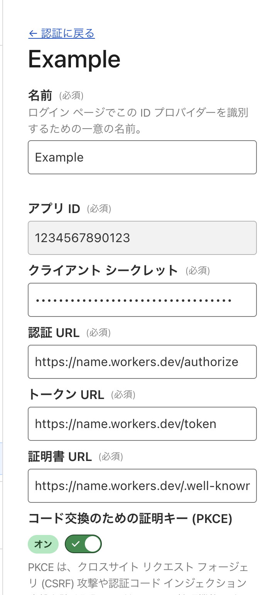

# Discord OIDC Proxy
OpenID Connect (OIDC) 認証を使用するアプリケーションが、DiscordのOAuth2システムを通じてユーザーを認証できるようにするプロキシ

[English](./README.md) | **Japanese**

Cloudflare Workers + Hono + pnpm

## What's this?
discord-oidc-proxyは、OpenID Connect (OIDC)認証を使用するアプリケーションがDiscordのアカウントを使用してユーザーを認証できるようにする、Cloudflare Workers上で動作するプロキシです。

discord-oidc-proxyを使用すると、Discordに登録されているユーザー名、ユーザーID、メールアドレスや、事前に設定したサーバー(ギルド)に所属しているか、ロールIDなどを基にアプリケーションで認証認可を行うことができます。

Discord APIはOAuth2エンドポイントのみを提供し、OIDC準拠のエンドポイントは提供していないため、標準的なOIDCフローを想定するアプリケーションとの互換性に問題が生じます。
このプロキシはOIDC準拠のエンドポイント（検出、認可、トークン、ユーザー情報）を公開しながら、内部的にはDiscordのOAuth2認証を管理します。これにより、Discord固有のOAuth2実装に対応するための変更を加えることなく、OIDCクライアントで簡単にDiscord認証を組み込めます。

## Requires
Discord OIDC Proxyを動作させるためには、以下のアカウントとソフトウェアが必要です。

- Discord Developerのアカウント([Discord for Developers https://discord.com/developers/]で取得できます)
- Cloudflareのアカウント
- [pnpm](https://github.com/pnpm/pnpm)
- サインイン済みの[wrangler](https://developers.cloudflare.com/workers/wrangler/)(Cloudflare Workers CLI)(`wrangler login`でログインできます)
- OpenSSL

## Usage for Server

1. [Discord Developer Portal](https://discord.com/developers/applications)にアクセスして、Applicationを作成します。
2. OAuth2ページを開いて、Client IDとClient Secretを控えます。
3. `pnpx wrangler kv namespace create "AUTH_KV"`を実行して、Workers KVを作成します。
4. 生成されたKVのIDで、`wrangler.jsonc`の`<YOUR_KV_NAMESPACE_ID>`を置換します。
5. `setup.sh`を実行し、指示に従ってClient IDとClient Secretを入力します。このとき、生成されたOIDC Client IDとOIDC Client Secretを控えます。
6. 一度`pnpm install && pnpm release`を実行します。
7. 表示されたデプロイ先Url(`https://hoge.workers.dev`)で`wrangler.jsonc`の`https://<YOUR_WORKERS>.workers.dev`を置換します。
8.  `pnpm release`して完了です。

## Usage for Clients
### スコープについて
スコープと取得できるクレームの対応を以下に示します。

スコープ|クレーム
-------|------
openid|sub
profile|name, preferred_username, picture, locale
email|email, email_verified
guild|is_member_of_target_guild, roles

### Cloudflare Access
Cloudflare Accessの認証方法としてDiscordを使うには、Cloudflare ZeroTrust>設定>認証>ログイン方法で新規追加をクリックし、OpenID Connect(OIDC)を選んで次のように設定します。

設定項目|値
-------|--
名前|任意の名前(Discordなど)
アプリID|生成された`OIDC Client ID`
クライアントシークレット|生成された`OIDC Client Secret`
認証URL|デプロイ先Url+"/authorize"
トークンURL|デプロイ先Url+"/token"
証明書URL|デプロイ先Url+"/.well-known/jwks.json"
コード交換のための証明キー (PKCE)|オン

**設定例**

### AWS Cognito
AWS Cognitoの認証方法としてDiscordを使うには、Cognito>ユーザープール><ユーザープール名>ソーシャルプロパイダーと外部プロパイダーで、アイデンティティプロパイダーを追加をクリックし、OpenID Connect(OIDC)を選んで次のように設定します。

設定項目|値
-------|--
プロバイダー名|任意の名前(Discordなど)
クライアント ID|生成された`OIDC Client ID`
クライアントシークレット|生成された`OIDC Client Secret`
許可されたスコープ|OIDCで取得する情報のスコープ(openid email profile identifyなど)
属性のリクエストメソッド|POST
セットアップ方法|発行者 URL を通じた自動入力
発行者 URL|デプロイ先Url

**設定例**

設定項目|値
-------|--
プロバイダー名|Discord
クライアント ID|1234567890123
クライアントシークレット|My.....secret
許可されたスコープ|openid email profile guild
属性のリクエストメソッド|POST
セットアップ方法|発行者 URL を通じた自動入力
発行者 URL|デプロイ先Url

## Security
このソフトウェアでセキュリティ上の脆弱性を発見された場合は、IssueやPull Requestを作成しないでください。 代わりに、以下のいずれかの方法でご報告ください。

- GitHubの[Security Advisory](https://github.com/taiseiue/discord-oidc-proxy/security/advisories)に投稿する
- taiseiue@wsnet.jp 宛に直接連絡する（PGP鍵は[OpenPGP](https://keys.openpgp.org/search?q=0D2E1F9F051058B2B360B34DA25AD3BFB865EC1E)から入手できます）

セキュリティ脆弱性に関するIssueが作成された場合、その内容は受理しますが、該当のIssueは削除します。

## Support
このプロジェクトでは、GMO FlattSecurity社の「GMO オープンソース開発者応援プログラム」の支援を受けて、「Takumi byGMO」によるセキュリティ診断を定期的に行っています。

このプロジェクトが良いと思ったら、ぜひ少額のご支援をお願いします。

