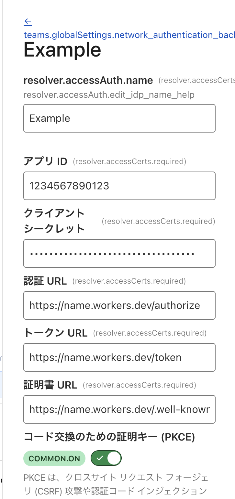

# Discord OIDC Proxy
The proxy that enables applications using OpenID Connect (OIDC) authentication to authenticate users through Discord's OAuth2 system.

|       |        |
|-------|--------|
|English|[Japanese](./README-ja.md)|

Cloudflare Workers + Hono + pnpm

## What's this?

discord-oidc-proxy is a proxy running on Cloudflare Workers that enables applications using OpenID Connect (OIDC) authentication to authenticate users through Discord's OAuth2 system.
The Discord API only provides OAuth2 endpoints and does not provide OIDC-compliant endpoints, which causes compatibility issues with applications that assume a standard OIDC flow.
This proxy exposes OIDC-compliant endpoints (discovery, authorization, token, user information) while internally managing Discord's OAuth2 authentication. This allows OIDC clients to easily integrate Discord authentication without making changes to accommodate Discord's proprietary OAuth2 implementation.

## Requirements
To run Discord OIDC Proxy, you need the following accounts and software:

- Discord Developer account (available at [Discord for Developers https://discord.com/developers/])
- Cloudflare account
- [pnpm](https://github.com/pnpm/pnpm)
- Signed-in [wrangler](https://developers.cloudflare.com/workers/wrangler/) (Cloudflare Workers CLI) (can be logged in with `wrangler login`)
- OpenSSL

## Usage for Server

1. Access the [Discord Developer Portal](https://discord.com/developers/applications) and create an application.
2. Open the OAuth2 page and make a note of the Client ID and Client Secret.
3. Run `pnpx wrangler kv namespace create “AUTH_KV”` to create Workers KV.
4. Replace `<YOUR_KV_NAMESPACE_ID>` in `wrangler.jsonc` with the generated KV ID.
5. Run `setup.sh` and follow the instructions to enter the Client ID and Client Secret. Make a note of the generated OIDC Client ID and OIDC Client Secret.
6. Run `pnpm install && pnpm release` once.
7. Replace `https://<YOUR_WORKERS>.workers.dev` in `wrangler.jsonc` with the displayed deployment URL (`https://hoge.workers.dev`).
8. Run `pnpm release` to complete.

## Usage for Clients
### Cloudflare Access
To use Discord as the authentication method for Cloudflare Access, click Add New under Cloudflare ZeroTrust > Settings > Authentication > Login Methods, select OpenID Connect (OIDC), and configure the settings as follows.

Setting | Value
-------|--
Name | Any name (e.g., Discord)
App ID | Generated `OIDC Client ID`
Client Secret | Generated `OIDC Client Secret`
Authentication URL|Deployment URL+“/authorize”
Token URL|Deployment URL+“/token”
Certificate URL|Deployment URL+“/.well-known/jwks.json”
Proof Key for Code Exchange (PKCE)|On

**Configuration Example**

### AWS Cognito
To use Discord as an authentication method for AWS Cognito, click Add Identity Provider under Cognito > User Pools > User Pool Name > Social Providers and External Providers, select OpenID Connect (OIDC), and configure the settings as follows.

Setting Item|Value
-------|--
Provider Name|Any name (e.g., Discord)
Client ID|Generated `OIDC Client ID`
Client Secret|Generated `OIDC Client Secret`
Allowed Scopes|Scopes of information to be retrieved via OIDC (e.g., openid, email, profile, identify)
Attribute Request Method|POST
Setup Method|Automatic input via Issuer URL
Issuer URL|Deployment URL

**Configuration example**

Configuration item|Value
-------|--
Provider name|Discord
Client ID|1234567890123
Client secret|My.....secret
Authorized scope|openid email profile identify
Attribute request method|POST
Setup method|Automatic input via issuer URL
Issuer URL|Deployment destination URL

## Security
If you discover a security vulnerability in this software, please do NOT create an Issue or Pull Request. Instead, please report it using one of the following methods:

- Post GitHub's [Security Advisory](https://github.com/taiseiue/discord-oidc-proxy/security/advisories)
- Contact taiseiue@wsnet.jp directly (PGP key available from [OpenPGP](https://keys.openpgp.org/search?q=0D2E1F9F051058B2B360B34DA25AD3BFB865EC1E))

If an Issue related to a security vulnerability is created, the information will be saved, but the Issue itself will be deleted.
